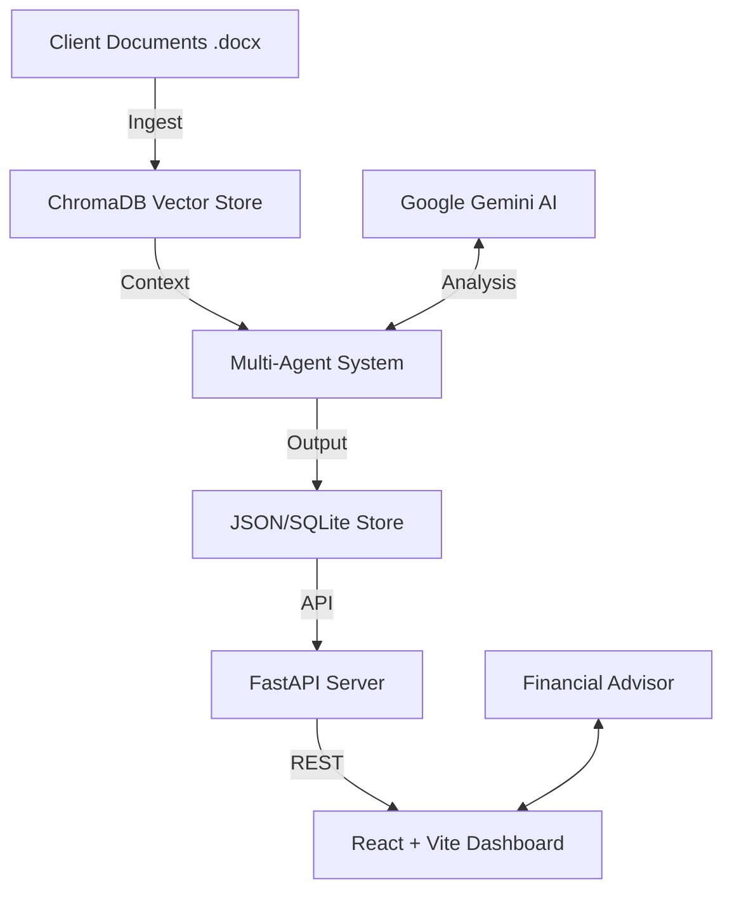

# Jarvis Auto-Pilot Agent 🚀

[](https://opensource.org/licenses/MIT)
[](https://www.python.org/downloads/)
[](https://reactjs.org/)
[](https://ai.google.dev/)

**AI that acts FOR you, not just advises.**


---

## 🎯 Problem Statement

Financial advisors face a critical scalability challenge: **The Proactivity Gap.** 
Advisors know that proactive outreach to clients creates the most value, yet it is the first thing sacrificed when the "daily grind" hits.
- **Data Overload**: Analyzing hundreds of client documents for opportunities takes hours of manual work.
- **Personalized Friction**: Drafting meaningful, contextual outreach is tedious and prone to "copy-paste" fatigue.
- **Reactive Cycle**: By 5:00 PM, most advisors have spent 100% of their time reacting to incoming requests, leaving zero room for growth-oriented outreach.

**As a result, high-value opportunities (Tax planning, R&D credits, Exit strategies) are missed, and clients feel neglected.**

---

## 💡 The Solution: Jarvis Auto-Pilot Agent

Jarvis is a truly **Autonomous AI Agent** designed to bridge the proactivity gap. Unlike standard chatbots that wait for user prompts, Jarvis **ACTS** on behalf of the advisor.

Jarvis autonomously analyzes client documents, identifies high-value opportunities based on deep document context, and crafts professional, personalized outreach—all while the advisor sleeps. 

### What was Implemented:
1.  **Autonomous Multi-Agent System**: Built using **LangGraph**, coordinating specialized agents for Research, Opportunity Analysis, and Email Writing.
2.  **RAG-Powered Intelligence**: A robust Retrieval-Augmented Generation system using **ChromaDB** to extract insights from actual client DOCX documents.
3.  **Synthetic CRM**: A pre-integrated ecosystem of **14 high-fidelity client profiles** and corresponding financial documents to demonstrate real-world scalability.
4.  **Executive Dashboard**: A premium React-based interface providing a real-time view of "Warm Leads" and autonomous agent activity.
5.  **Sentiment-Driven Prioritization**: Automatic detection of client interest to surface the most valuable conversations for the advisor.

---

## 🏗️ Technical Architecture

### Workflow Diagram


---

## ✨ Key Features

- 🕵️ **Autonomous Context Research**: Scans through balance sheets, meeting notes, and tax returns via RAG.
- 🧠 **Strategic Opportunity Detection**: Uses LLM reasoning to find tax efficiencies and planning milestones.
- ✍️ **Human-Centric Outreach**: Generates contextual emails that maintain the advisor's professional tone.
- 🎯 **Warm Lead Surface**: Prioritizes clients who have already responded or shown high interest levels.
- 📊 **Real-time Metrics**: Tracks agent efficiency, response rates, and engagement scores.

---

## 🚀 Local Setup Instructions

### Prerequisites
- **Python 3.9+**
- **Node.js 18+**
- **Google Gemini API Key** ([Get it here](https://makersuite.google.com/app/apikey))

### 1. Clone & Install
```bash
# Clone the repository
git clone https://github.com/saikiran1224/AdvisoryAI_Jarvis-Auto-Pilot_Agent.git
cd Jarvis-Auto-Pilot

# Run the automated setup script
chmod +x setup.sh run.sh run_analysis.sh
./setup.sh
```

### 2. Configuration
Create a `.env` file in the `backend/` directory:
```env
GEMINI_API_KEY=your_actual_gemini_api_key_here
```

### 3. Launch Application
In the root directory, run:
```bash
./run.sh
```
- **Dashboard**: [http://localhost:5173](http://localhost:5173)
- **API Documentation**: [http://localhost:8000/docs](http://localhost:8000/docs)

### 4. Run AI Analysis (Agent Workflow)
To trigger the autonomous analysis of the 14 CRM profiles:
```bash
./run_analysis.sh
```

---

## 🗄️ Synthetic CRM Overview
The project includes a **Synthetic CRM** containing **14 diverse profiles** to demonstrate system performance at scale:

*   **Profiles include**: Real Estate Investors (Basil Fawlty), Pharmaceutical Directors (Emma Thompson), Tech Entrepreneurs (Hyacinth Buckket), and more.
*   **Each profile features**: A dedicated `.docx` financial summary, pre-calculated engagement scores, and mock interaction history.

---

## 📂 Project Structure

```text
├── backend/                 # FastAPI Server & AI Engine
│   ├── ai_agent.py         # Autonomous Agent entry point
│   ├── app.py              # Main API server logic
│   ├── agentic_system.py   # LangGraph Multi-Agent coordination
│   ├── rag_system.py       # Document ingestion & Vector search
│   ├── data/               # CRM Data, DOCX files, & Vector DB
│   └── requirements.txt    # Python dependencies
│
├── frontend/               # React Dashboard (Vite)
│   ├── src/                # UI Components & Design System
│   └── public/             # Static Assets & Branding
│
├── setup.sh                # Dependency installation script
├── run.sh                  # Application launch script
└── run_analysis.sh         # AI agent execution script
```

---

## 🛠️ Tech Stack

**Backend:** FastAPI, LangGraph, ChromaDB, Google Gemini (Gemma family), python-docx.  
**Frontend:** React 18, Vite, Lucide React, Custom Glassmorphic CSS.  
**Infrastructure:** REST API, RAG Architecture, Multi-Agent workflows.

---

## 🛤️ Future Roadmap

- [ ] **Direct Integration**: Native API connections for Gmail, Outlook, and Google Calendar.
- [ ] **Voice-to-Context**: Transcribing meeting notes directly into the RAG system.
- [ ] **CRM Sync**: Two-way data synchronization with Salesforce and Wealthbox.
- [ ] **Predictive Churn**: Identifying clients at risk of leaving based on sentiment decay.

---

## 📄 License
This project is licensed under the MIT License.
